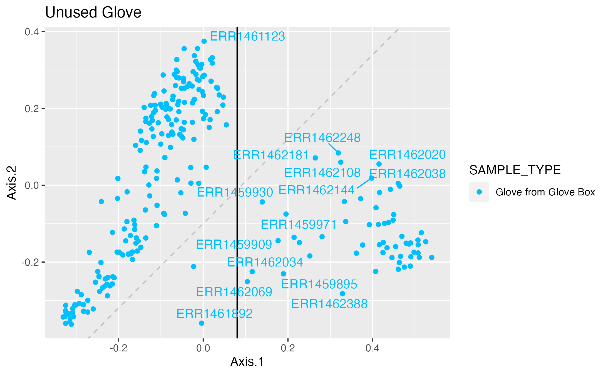

```{r setup, include=FALSE}
knitr::opts_chunk$set(echo = TRUE)
```

This data comes from the Hospital Microbiome Project.  There are several publications, reports and presentations describing the sampling effort that took place at the new hospital in Chicago before and after it opened in 2013.

The sequence data was published in @lax_et_al2017. 

[“Bacterial Colonization and Succession in a Newly Opened Hospital.”](https://www.ncbi.nlm.nih.gov/pmc/articles/PMC5706123/)

Abiotic environment measurements were published in @ramos_spatial_2015.

[“Spatial and Temporal Variations in Indoor Environmental Conditions, Human Occupancy, and Operational Characteristics in a New Hospital Building.”](https://journals.plos.org/plosone/article?id=10.1371/journal.pone.0118207)

These data can be linked using a mapping obtained from the authors.  PreMiEr researchers can contact the Fodor lab to access this.

## Resources

The raw sequences were downloaded from the NCBI's SRA project: [PRJEB14474](https://www.ncbi.nlm.nih.gov/bioproject/PRJEB14474/)

A limitation: The publication discusses 6,523 16S samples but the corresponding SRA project only has 3,079. After removing technical replicates, that becomes 2,756 unique samples.

Here is a visual summary of the samples types (rows) and locations (columns) with an indication of how many samples (color) are available for each type/location intersection.

{width=90%}

For more comments and graphics to get acquainted with the dataset, see the [PRJEB14474 metadata exploration](./markdown-htmls/PRJEB14474_metadataExplorer.html).

The scripts for processing and for several analyses are available in this github repository: [github.com/IvoryC/BuiltEnvData](https://github.com/IvoryC/BuiltEnvData/tree/main)

In short, we used the DADA2 pipeline, assigned taxonomy using silva 138, and filtered for low rarity and scarcity.

Counts tables (and taxonomy, etc) are available via google drive. Contact the Fodor lab.

Additional metadata was obtained via correspondence with the authors. This allowed us to determine the "day of stay" feature for several samples.  PreMiEr researchers can contact the Fodor lab to get this mapping file.

## Analyses

A few examples of what we can do with this dataset.

### Reproduce figure 1A.

[See the code walk through.][fig1a]

In this document we approximately reproduce figure 1A of @lax_et_al2017 using the counts table we generated with DADA2.

{width=50%}

### Hand correlation with Bedrail on day 1 vs day 2

This was the subject of Nico's REU poster in summer 2023.

{width=50%}

### Staff skin and station surfaces

image...

analysis html link...

### Gloves

[See the gloves analyis.][gloves]

This analysis looks at the "gloves from glovebox" samples and presents the idea of using these samples as a pseudo blank.

{width=50%}


### References

<div id="refs"></div>

[fig1a]: markdown-htmls/Figure_1A.html "Title"
[gloves]: markdown-htmls/Gloves.html "Title"
